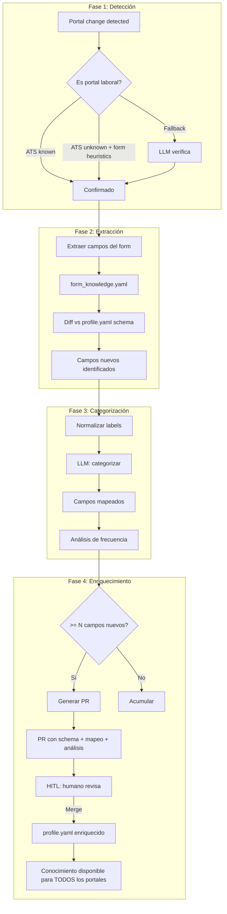

# Portal Learning & Auto-Correction

Sistema de aprendizaje continuo que convierte interacciones con portales en conocimiento estructurado y propuestas de enriquecimiento del perfil candidato.

## Filosofía

> **Uso = Exploración**  
> Aplicar a trabajos no es solo consumo, es descubrimiento. Cada portal que pide algo nuevo nos enseña qué más debería tener un perfil completo.

> **Meta-portal**  
> El union set de todos los campos que todos los portales han pedido. No inventamos campos; los portales laborales nos dicen qué es importante.

## El problema

1. **Portales cambian**: GetOnBoard retorna 403 → el test falla → bloqueamos PRs no relacionados
2. **Campos nuevos aparecen**: un portal pide "work authorization Chile" y no está en `profile.yaml`
3. **Conocimiento fragmentado**: cada portal tiene campos únicos que podrían servir en otros
4. **Oportunidad perdida**: sabemos qué piden 15 portales pero solo usamos esa info para ese portal específico

## La solución: Auto-corrección en 4 fases



## Flujo detallado

### 1. Detección de portal laboral

**Input**: URL + HTML (o error de acceso)

**Lógica**:
```python
def is_job_portal(url: str, html: str | None) -> tuple[bool, str]:
    """
    Retorna (es_portal, evidencia).
    Nunca leftover: todo tiene veredicto explícito.
    """
    # 1. ATS conocido → definitivamente portal
    ats, evidence = detect_ats_in_html(html) if html else (AtsKind.UNKNOWN, "")
    if ats != AtsKind.UNKNOWN:
        return True, f"ATS detected: {ats} ({evidence})"
    
    # 2. Heurística de form: si pide CV + email + screening questions
    if html:
        form = learn_form_html(html, url=url)
        if form.readable and _looks_like_job_application(form):
            return True, f"Form heuristic: CV upload + {len(form.screening_questions())} screening questions"
    
    # 3. Dominio activo en companies.yaml
    if url in active_company_domains():
        return True, "Active in companies registry"
    
    # 4. LLM fallback (no leftover)
    result = llm_classify_portal(url, html)
    return result.is_job_portal, f"LLM classification: {result.reasoning}"
```

**Evidencia suficiente** (cualquiera):
- `ATS != unknown`
- Form pide: CV/resume + email + ≥1 screening question
- Dominio en `companies.yaml` con `status=active`
- LLM confirma (cuando todo lo anterior falla)

### 2. Extracción de campos

**Ya implementado**: `learn_form_html()` en `portals/form_learn.py`

**Output**: `FormKnowledge` con:
```python
FormField(
    name="work_auth_cl",
    label="¿Tienes visa de trabajo para Chile?",
    kind=FieldKind.SELECT,
    required=True,
    options=["Sí", "No", "En trámite"],
    is_screening=True
)
```

**Acumulación**: `form_knowledge.yaml` (local, gitignored)

### 3. Diff y normalización

**Campo nuevo** = no existe equivalente en `profile.yaml` schema

**Normalización**:
- `"email"` ≈ `"correo electrónico"` ≈ `"e-mail"` → **NO es nuevo** (ya existe `personal.email`)
- `"work authorization Chile"` → **SÍ es nuevo** (no hay `legal_status.work_authorization`)

**Algoritmo**:
```python
def diff_fields(
    forms: list[FormKnowledge],
    profile_schema: dict[str, Any]
) -> list[NewField]:
    """
    Retorna campos que aparecen en forms pero no en profile.yaml.
    """
    seen_in_forms = extract_all_fields(forms)
    seen_in_profile = extract_schema_fields(profile_schema)
    
    new_fields = []
    for field in seen_in_forms:
        normalized = normalize_field_label(field.label)
        if not has_semantic_match(normalized, seen_in_profile):
            new_fields.append(field)
    
    return deduplicate_by_semantic_similarity(new_fields)
```

### 4. Categorización con LLM

**Input**: Campo nuevo + contexto de dónde apareció

**Prompt template**:
```
Tienes un campo de formulario de postulación laboral que NO existe en el schema actual de profile.yaml.

Campo observado:
- Label: "¿Tienes visa de trabajo para Chile?"
- Tipo: select (opciones: Sí, No, En trámite)
- Requerido: true
- Visto en portales: [greenhouse-acme, workday-retail, getonboard]
- Frecuencia: 3/15 portales lo piden

Schema actual de profile.yaml:
```yaml
personal: {name, email, phone, city, country, linkedin, github}
experience: [{company, title, start_date, end_date, achievements}]
education: [{institution, degree, start_date, end_date}]
skills: {programming, machine_learning, cloud, statistics}
publications: [{title, journal, year}]
```

Tarea:
1. ¿A qué sección pertenece? (elige de: personal, experience, education, skills, legal_status, compensation, preferences, other)
2. ¿Qué path dentro de esa sección? (ej: legal_status.work_authorization.countries)
3. ¿Qué tipo de dato? (str, bool, int, list[str], dict[str, bool])
4. ¿Qué nombre de campo en snake_case?

Responde en JSON.
```

**Output**:
```json
{
  "suggested_section": "legal_status",
  "suggested_path": "legal_status.work_authorization",
  "suggested_type": "dict[str, bool]",
  "suggested_field_name": "work_authorization",
  "reasoning": "Work authorization is legal status that varies by country. Dict allows per-country tracking.",
  "example_value": {"cl": true, "us": false}
}
```

### 5. Análisis de frecuencia

**Pregunta clave**: ¿Qué tan importante es este campo?

**Métricas**:
```python
@dataclass
class FieldAnalysis:
    field_id: str
    labels_seen: list[str]  # Variaciones del mismo campo
    portals: list[str]      # Qué portales lo piden
    frequency: int          # N de portales
    required_count: int     # Cuántos lo marcan como required
    suggested_category: str
    suggested_schema: dict[str, Any]
    cross_portal_value: float  # Score: ¿sirve para otros portales?
```

**Cross-portal value**:
- Campo que 1 portal pide: bajo (puede ser idiosincrasia)
- Campo que 5+ portales piden: alto (es estándar de la industria)
- Campo que varios ATS diferentes piden: muy alto (meta-portal knowledge)

### 6. Generación de PR

**Trigger**: cuando `len(campos_nuevos) >= threshold` (default: 5)

**Contenido del PR**:

1. **Título**: `[meta-portal] Enrich profile schema: N new fields from M portals`

2. **Cambios a `profile.example.yaml`**:
```yaml
# ANTES
personal:
  name: Ana Ejemplo
  email: ana@example.com

# DESPUÉS
personal:
  name: Ana Ejemplo
  email: ana@example.com

legal_status:  # NUEVO
  work_authorization:
    cl: true
    us: false
  visa_type: null

compensation:  # NUEVO
  expected_monthly:
    clp: 3500000
  expected_annual:
    usd: null
```

3. **Mapeo para adapters** (`docs/field-mappings.md` actualizado):
```markdown
## work_authorization

**Profile path**: `legal_status.work_authorization[country_code]`
**Type**: `dict[str, bool]`

**Portal mappings**:
- Greenhouse: "Are you legally authorized to work in [country]?" → `work_authorization[country]`
- Workday: "Work Authorization - Chile" → `work_authorization.cl`
- GetOnBoard: "¿Tienes visa de trabajo?" (when job.location=Chile) → `work_authorization.cl`
```

4. **Análisis completo** (en PR body o archivo adjunto):
```yaml
# output/portals/enrichment_analysis_2026-09-23.yaml
version: 1
analyzed_at: 2026-09-23T21:09:00Z
total_forms_analyzed: 15
total_fields_observed: 187
new_fields_found: 8
threshold_met: true

new_fields:
  - field_id: work_authorization_chile
    labels_seen:
      - "¿Tienes visa de trabajo para Chile?"
      - "Are you legally authorized to work in Chile?"
      - "Work Authorization - Chile"
    portals:
      - name: greenhouse-acme
        url: https://boards.greenhouse.io/acme/apply
        required: true
      - name: workday-retail
        url: https://retail.wd1.myworkdayjobs.com/careers
        required: true
      - name: getonboard
        url: https://www.getonbrd.com/apply/123
        required: false
    frequency: 3
    required_ratio: 0.67
    cross_portal_value: 0.85  # Alto: 3 ATS diferentes lo piden
    
    categorization:
      suggested_category: legal_status
      suggested_path: legal_status.work_authorization
      suggested_type: dict[str, bool]
      reasoning: |
        Work authorization is legal status that varies by country.
        Multiple portals ask this for Chile specifically, and the same
        pattern likely applies to other countries. Dict structure allows
        per-country tracking.
      llm_model: gpt-4o-mini
      llm_confidence: 0.92
    
    suggested_schema:
      legal_status:
        work_authorization:
          cl: true  # Chile
          us: false
          ar: null  # Argentina (not asked yet, but pattern extends)
    
    impact:
      unlocks_portals: [greenhouse-acme, workday-retail, getonboard]
      estimated_applications_blocked: 12  # Jobs where this was required
```

### 7. HITL Review

**Humano revisa el PR**:
- ✅ Schema changes razonables
- ✅ Mapeos correctos
- ✅ Categorización tiene sentido
- ⚠️ Ajustes: renombrar campo, cambiar tipo, mover sección
- ❌ Rechazar: campo demasiado específico, no aporta valor cross-portal

**Post-merge**:
- Campo disponible en `profile.yaml`
- Adapters pueden usar el nuevo campo
- Próximas aplicaciones a esos portales usan el campo automáticamente
- **Conocimiento se propaga**: otros portales que pidan lo mismo ya tienen el campo

## Idempotencia

**Problema**: evitar PRs duplicados y re-analizar lo mismo

**Solución**: `data/enrichment_state.yaml` (gitignored)
```yaml
version: 1
last_analysis: 2026-09-23T21:09:00Z
analyzed_fields:
  - field_id: work_authorization_chile
    field_hash: "sha256:abc123..."
    first_seen: 2026-09-15T10:30:00Z
    analyzed_at: 2026-09-23T21:09:00Z
    status: proposed  # proposed | merged | rejected
    pr_url: https://github.com/user/repo/pull/123
  
  - field_id: expected_salary_clp
    field_hash: "sha256:def456..."
    first_seen: 2026-09-20T14:20:00Z
    analyzed_at: 2026-09-23T21:09:00Z
    status: proposed
    pr_url: https://github.com/user/repo/pull/123

thresholds:
  new_fields_for_pr: 5
  min_frequency: 2  # Campo debe aparecer en ≥2 portales
```

**Hash del campo**:
```python
def field_hash(field: FormField) -> str:
    """
    Hash estable basado en contenido semántico, no label exacto.
    Dos labels distintos con el mismo significado → mismo hash.
    """
    normalized = normalize_field_label(field.label)
    semantic_key = f"{normalized}|{field.kind}|{sorted(field.options)}"
    return hashlib.sha256(semantic_key.encode()).hexdigest()
```

## Triggers

### 1. On-demand
```bash
jobbot portals enrich-suggest
```
Analiza todo `form_knowledge.yaml` ahora mismo, crea PR si `>= threshold` campos nuevos.

### 2. Auto en `companies recon --apply`
```bash
jobbot companies recon ACME --fixture page.html --apply
```
Después de guardar la observación:
1. Cuenta campos nuevos acumulados
2. Si `>= threshold`: lanza análisis + PR automático
3. Mensaje: `✓ Observation stored. 3 new fields accumulated (2 more to trigger enrichment PR).`

### 3. Batch periódico (futuro)
```bash
jobbot portals enrich-batch --threshold 5 --min-frequency 2
```
Analiza todo, filtra por frecuencia mínima, crea PR si supera threshold.

## Ejemplo completo: GetOnBoard 403

**Estado inicial**:
- Test `test_search_jobs_api_smoke` hace llamada real a GetOnBoard API
- API retorna 403 Forbidden
- Test falla → PR #51 bloqueado

**Auto-corrección**:

1. **Detección** (ya hecho en el fix anterior):
   - Test detecta 403 → skip con mensaje
   - Sistema registra: "GetOnBoard bloqueó acceso en 2026-09-23"

2. **Oportunidad de aprendizaje** (próximo paso):
   - GetOnBoard es portal laboral conocido (ATS detection)
   - Ya tenemos `form_knowledge.yaml` con campos de GetOnBoard
   - Analizamos: ¿qué campos pide GetOnBoard que no tenemos en profile.yaml?

3. **Descubrimiento** (hipotético):
   ```yaml
   # GetOnBoard pide pero profile.yaml no tiene:
   - "¿Cuál es tu pretensión de renta?" → compensation.expected_monthly.clp
   - "¿Estás dispuesto a trabajar remoto?" → preferences.remote_work
   - "¿Tienes título profesional?" → education.has_degree (bool)
   ```

4. **Enriquecimiento**:
   - LLM categoriza los 3 campos
   - Genera PR: `[meta-portal] Add compensation and preferences from GetOnBoard + 2 other portals`
   - PR contiene schema changes + análisis

5. **Resultado**:
   - Humano revisa y mergea PR
   - `profile.yaml` ahora tiene esos campos
   - GetOnBoard adapter puede usar los campos automáticamente
   - **Bonus**: Greenhouse también pregunta "expected salary" → mismo campo sirve para ambos
   - **Meta-portal**: el union set crece

## Métricas de éxito

**Cobertura de portales**:
```python
coverage = (
    count(portales con todos los campos mapeados) /
    count(portales activos)
)
```
Meta: 80%+ de portales activos tienen ≥90% de sus campos en profile.yaml

**Cross-portal reuse**:
```python
reuse_ratio = (
    count(campos usados por ≥2 portales) /
    count(campos totales)
)
```
Meta: 60%+ de campos sirven para múltiples portales

**Time to enrichment**:
- Desde "campo nuevo observado" hasta "PR propuesto": < 1 hora (automático)
- Desde "PR propuesto" hasta "merged": < 24h (HITL)

## Expansión futura

### Aprendizaje inverso: profile → portales
Cuando un campo de `profile.yaml` nunca se usa en ningún portal:
- ¿Es obsoleto?
- ¿Debería sugerirse eliminarlo?
- PR inverso: `[meta-portal] Remove unused field: personal.fax`

### Validación cruzada
Campo que 10 portales piden como `select["Sí", "No"]` y 1 portal pide como `text`:
- Reportar inconsistencia
- Sugerir estandarización

### Ontología de portales
```yaml
portal_clusters:
  - name: "LATAM startups"
    portals: [getonboard, torre, startupjobs]
    common_fields: [remote_work, equity, startup_stage]
  
  - name: "Enterprise Chile"
    portals: [workday-retail, successfactors-bank]
    common_fields: [work_authorization_cl, rut, salary_clp]
```

Sugerencia: "Aplicando a startups LATAM → deberías completar estos 3 campos comunes"

## Resumen

**Input**: Interacciones con portales (recon, form_learn, apply)

**Output**: Pull Requests con enriquecimientos basados en evidencia

**Invariante**: Nunca inventamos campos. Los portales nos dicen qué existe en el mercado laboral real.

**Meta**: Converger a un meta-portal que capture la union de todos los campos que todos los sistemas ATS piden, disponible para un candidato, compartible entre personas.

---

**Next steps**: Implementar componentes en orden (ver plan de arquitectura).
