# UML — dominio y puertos

Fuente canónica de los diagramas del [software design](software-design.md).
Los PRs que añaden un tipo de dominio o un puerto **actualizan este archivo**
(o fallan el criterio de aceptación del issue).

Convención: cada diagrama tiene un ancla (`{#id}`). Los issues citan
`docs/uml.md#id`.

## Dominio actual — aggregate `Candidate` {#candidate-now}

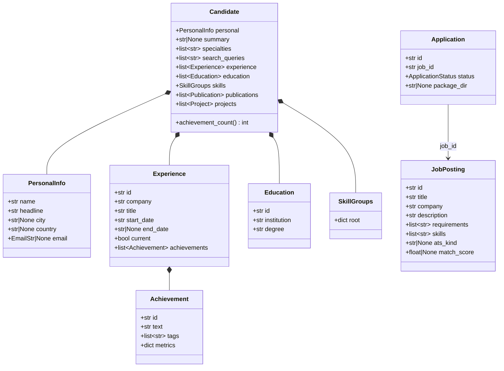
```mermaid
classDiagram
  direction TB
  class Candidate {
    +PersonalInfo personal
    +str|None summary
    +list~str~ specialties
    +list~str~ search_queries
    +list~Experience~ experience
    +list~Education~ education
    +SkillGroups skills
    +list~Publication~ publications
    +list~Project~ projects
    +achievement_count() int
  }
  class PersonalInfo {
    +str name
    +str headline
    +str|None city
    +str|None country
    +EmailStr|None email
  }
  class Experience {
    +str id
    +str company
    +str title
    +str start_date
    +str|None end_date
    +bool current
    +list~Achievement~ achievements
  }
  class Achievement {
    +str id
    +str text
    +list~str~ tags
    +dict metrics
  }
  class Education {
    +str id
    +str institution
    +str degree
  }
  class SkillGroups {
    +dict root
  }
  class JobPosting {
    +str id
    +str title
    +str company
    +str description
    +list~str~ requirements
    +list~str~ skills
    +str|None ats_kind
    +float|None match_score
  }
  class Application {
    +str id
    +str job_id
    +ApplicationStatus status
    +str|None package_dir
  }
  Candidate *-- PersonalInfo
  Candidate *-- Experience
  Candidate *-- Education
  Candidate *-- SkillGroups
  Experience *-- Achievement
  Application --> JobPosting : job_id
```

## Target — hechos vs preferencias + evidencia {#fact-preference}

Patrones: **Aggregate Root**, **Value Object**, asociación skills↔roles.
Issues: #141 #144 #185 #195 #206 #221.


```mermaid
classDiagram
  direction TB
  class Candidate {
    <<Fact aggregate>>
    +PersonalInfo personal
    +list~Experience~ experience
    +list~Education~ education
    +list~LanguageSkill~ languages
    +list~Certification~ certifications
    +list~SkillUse~ skill_uses
  }
  class ApplicationPreferences {
    <<Preference aggregate>>
    +work_auth
    +relocation
    +salary_expectation
    +answers
  }
  class LanguageSkill {
    <<Value Object>>
    +str name
    +CEFR|native level
    +str|None evidence
  }
  class Education {
    +EducationStatus status
    +YearMonth|None expected_end
  }
  class Experience {
    +str company
    +str|None unit
    +WorkMode|None work_mode
  }
  class SkillUse {
    +str skill
    +str experience_id
    +EvidenceStrength strength
  }
  class EvidenceStrength {
    <<Enumeration>>
    claim
    experience
    evidence
    assessed
  }
  class Requirement {
    <<Value Object>>
    +must|want kind
    +str text
    +str|None source_span
  }
  class JobPosting {
    +list~Requirement~ requirements_typed
    +PostingClarity clarity
    +datetime|None closes_at
    +str|None closes_timezone
  }
  class ProfileOverlay {
    <<Projection>>
    +str lang
    +dict by_id
    +source_hash per entry
  }
  Candidate ..> ApplicationPreferences : used with
  Candidate ..> ProfileOverlay : composed with
  Candidate *-- LanguageSkill
  Candidate *-- SkillUse
  Candidate *-- Experience
  Candidate *-- Education
  JobPosting *-- Requirement
  SkillUse --> EvidenceStrength
```

## Puertos y adapters (hexagonal) {#ports}

Patrones: **Port/Adapter**, **Factory**, **Strategy**, **Registry**.

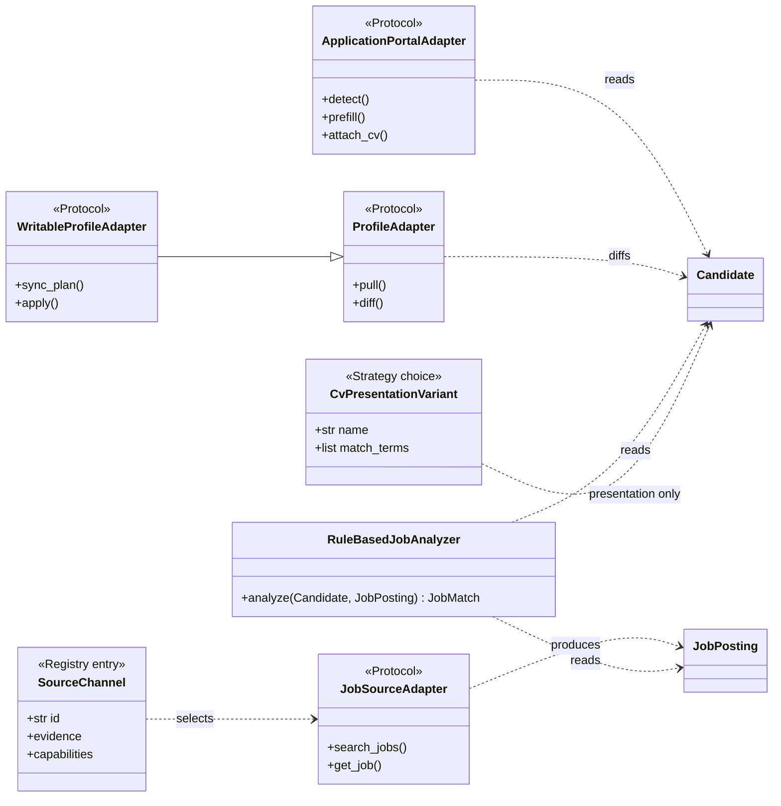
```mermaid
classDiagram
  direction LR
  class Candidate
  class JobPosting
  class JobSourceAdapter {
    <<Protocol>>
    +search_jobs()
    +get_job()
  }
  class ApplicationPortalAdapter {
    <<Protocol>>
    +detect()
    +prefill()
    +attach_cv()
  }
  class ProfileAdapter {
    <<Protocol>>
    +pull()
    +diff()
  }
  class WritableProfileAdapter {
    <<Protocol>>
    +sync_plan()
    +apply()
  }
  class RuleBasedJobAnalyzer {
    +analyze(Candidate, JobPosting) JobMatch
  }
  class SourceChannel {
    <<Registry entry>>
    +str id
    +evidence
    +capabilities
  }
  class CvPresentationVariant {
    <<Strategy choice>>
    +str name
    +list match_terms
  }
  JobSourceAdapter ..> JobPosting : produces
  ApplicationPortalAdapter ..> Candidate : reads
  ProfileAdapter ..> Candidate : diffs
  WritableProfileAdapter --|> ProfileAdapter
  RuleBasedJobAnalyzer ..> Candidate : reads
  RuleBasedJobAnalyzer ..> JobPosting : reads
  SourceChannel ..> JobSourceAdapter : selects
  CvPresentationVariant ..> Candidate : presentation only
```

## Plan-then-apply (Command) {#plan-apply}

Patrón: **Template Method** / **Command** con dry-run default.

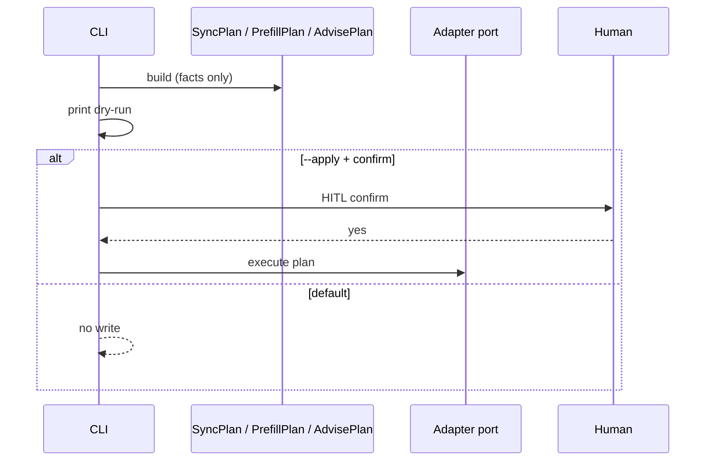
```mermaid
sequenceDiagram
  participant CLI
  participant Plan as SyncPlan / PrefillPlan / AdvisePlan
  participant Port as Adapter port
  participant Human
  CLI->>Plan: build (facts only)
  CLI->>CLI: print dry-run
  alt --apply + confirm
    CLI->>Human: HITL confirm
    Human-->>CLI: yes
    CLI->>Port: execute plan
  else default
    CLI-->>CLI: no write
  end
```

## Specification — condiciones / elegibilidad {#specification}

Patrones: **Specification**, **Result object**. Issues: #166 #186.

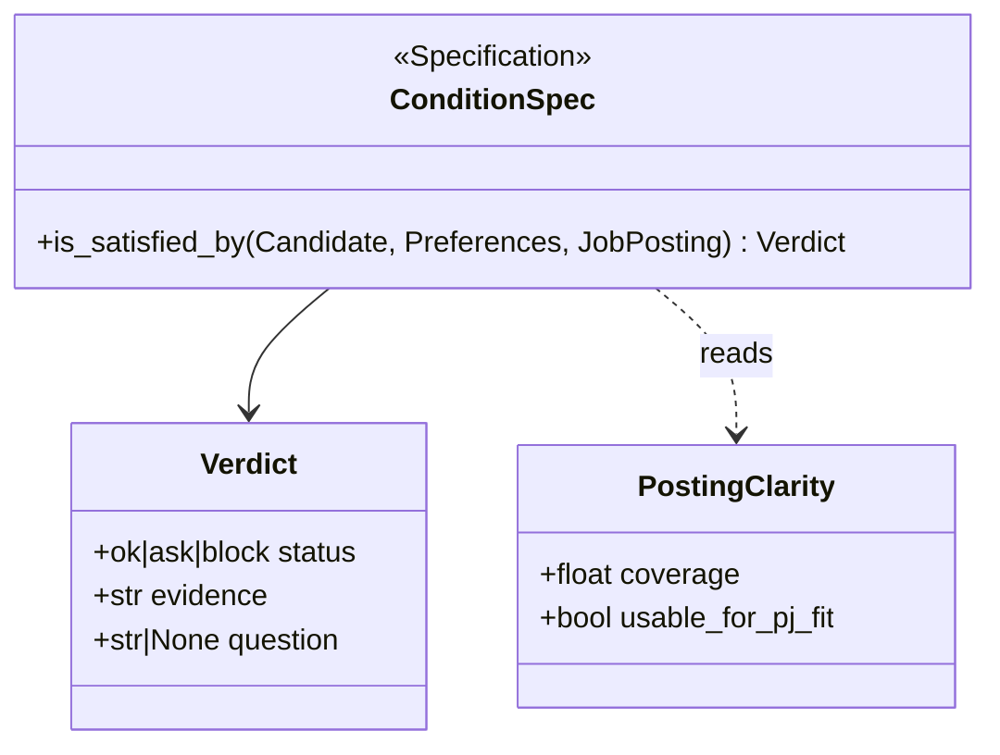
```mermaid
classDiagram
  direction TB
  class ConditionSpec {
    <<Specification>>
    +is_satisfied_by(Candidate, Preferences, JobPosting) Verdict
  }
  class Verdict {
    +ok|ask|block status
    +str evidence
    +str|None question
  }
  class PostingClarity {
    +float coverage
    +bool usable_for_pj_fit
  }
  ConditionSpec --> Verdict
  ConditionSpec ..> PostingClarity : reads
```

## Anti-corruption — homologación portal → perfil {#acl}

Patrón: **Anti-Corruption Layer**. Issue: #94.

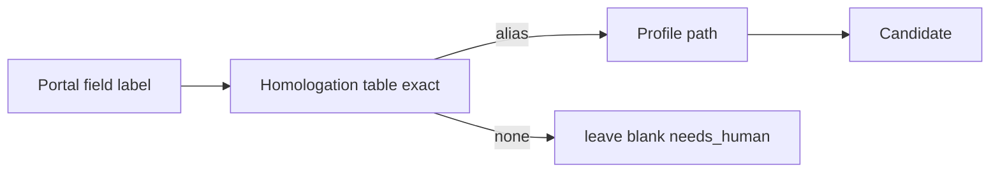
```mermaid
flowchart LR
  Portal[Portal field label] --> ACL[Homologation table exact]
  ACL -->|alias| Path[Profile path]
  ACL -->|none| Empty[leave blank needs_human]
  Path --> Candidate
```

## HITL pause — desafío / CAPTCHA (sin bypass) {#hitl-pause}

Patrones: **Guard** (TTY), **Template Method** (`pause_for_manual`). Issue: #392.

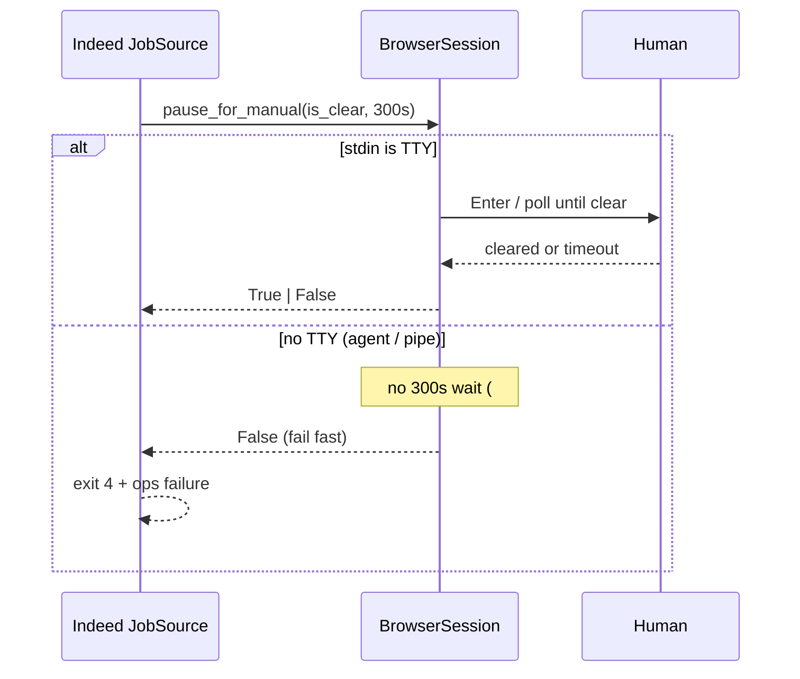
```mermaid
sequenceDiagram
  participant Adapter as Indeed JobSource
  participant Session as BrowserSession
  participant Human
  Adapter->>Session: pause_for_manual(is_clear, 300s)
  alt stdin is TTY
    Session->>Human: Enter / poll until clear
    Human-->>Session: cleared or timeout
    Session-->>Adapter: True | False
  else no TTY (agent / pipe)
    Note over Session: no 300s wait (#392)
    Session-->>Adapter: False (fail fast)
    Adapter-->>Adapter: exit 4 + ops failure
  end
```

Reglas: nunca resolver CAPTCHA; nunca informar el desafío como lista vacía (#184); sin TTY no se bloquea el proceso 5 minutos.

## Search outcome — vacío ≠ falla ≠ off-topic {#search-outcome}

Patrones: **Result object**, **discriminated union**. Issues: #390 #176 #184.

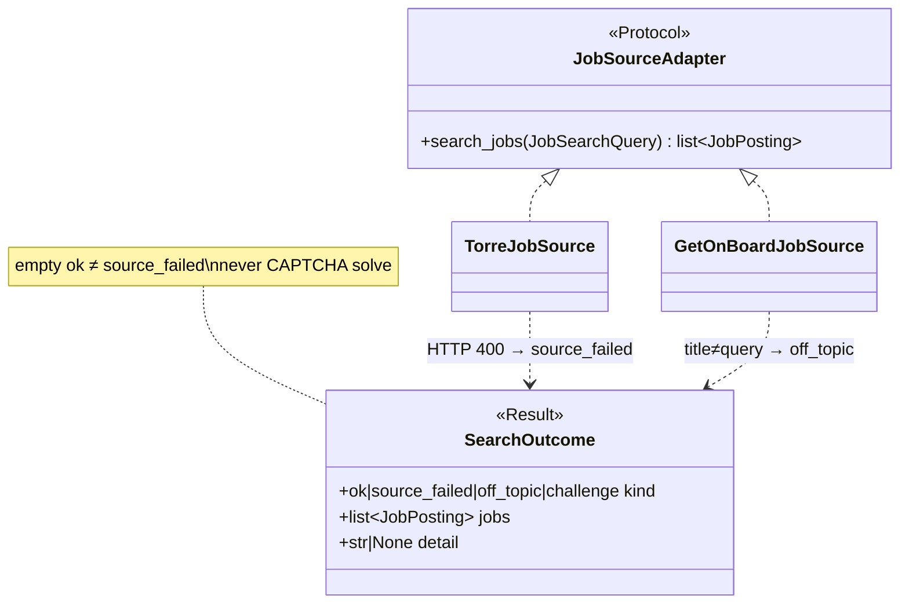
```mermaid
classDiagram
  direction TB
  class JobSourceAdapter {
    <<Protocol>>
    +search_jobs(JobSearchQuery) list~JobPosting~
  }
  class SearchOutcome {
    <<Result>>
    +ok|source_failed|off_topic|challenge kind
    +list~JobPosting~ jobs
    +str|None detail
  }
  class TorreJobSource
  class GetOnBoardJobSource
  JobSourceAdapter <|.. TorreJobSource
  JobSourceAdapter <|.. GetOnBoardJobSource
  TorreJobSource ..> SearchOutcome : HTTP 400 → source_failed
  GetOnBoardJobSource ..> SearchOutcome : title≠query → off_topic
  note for SearchOutcome "empty ok ≠ source_failed\nnever CAPTCHA solve"
```

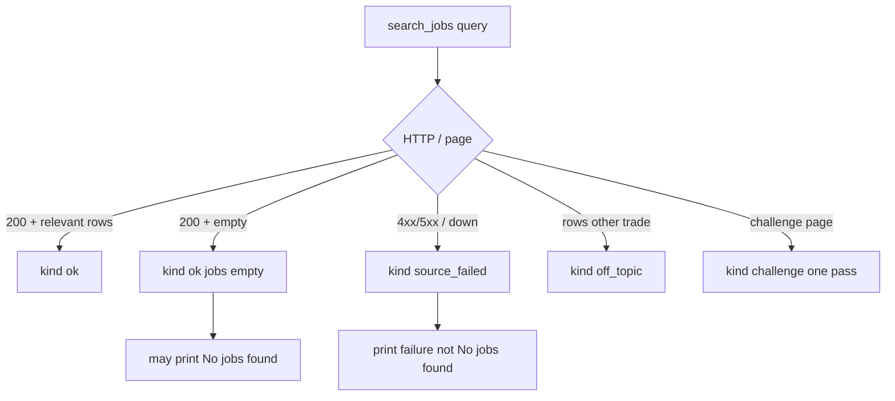
```mermaid
flowchart TD
  Q[search_jobs query] --> R{HTTP / page}
  R -->|200 + relevant rows| Ok[kind ok]
  R -->|200 + empty| Empty[kind ok jobs empty]
  R -->|4xx/5xx / down| Fail[kind source_failed]
  R -->|rows other trade| Off[kind off_topic]
  R -->|challenge page| Ch[kind challenge one pass]
  Fail --> Msg[print failure not No jobs found]
  Empty --> MsgOk[may print No jobs found]
```

## Posting URL verify — ficha vs SERP {#posting-url-verify}

Patrones: **Specification**, **Value Object** (evidencia de URL). Issue: #388 (#182 id-only, #215 Workday).

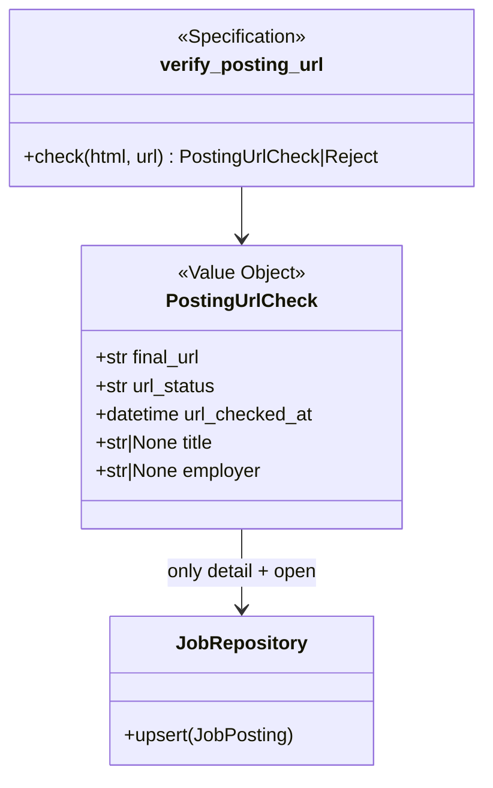
```mermaid
classDiagram
  direction TB
  class PostingUrlCheck {
    <<Value Object>>
    +str final_url
    +str url_status
    +datetime url_checked_at
    +str|None title
    +str|None employer
  }
  class verify_posting_url {
    <<Specification>>
    +check(html, url) PostingUrlCheck|Reject
  }
  class JobRepository {
    +upsert(JobPosting)
  }
  verify_posting_url --> PostingUrlCheck
  PostingUrlCheck --> JobRepository : only detail + open
```

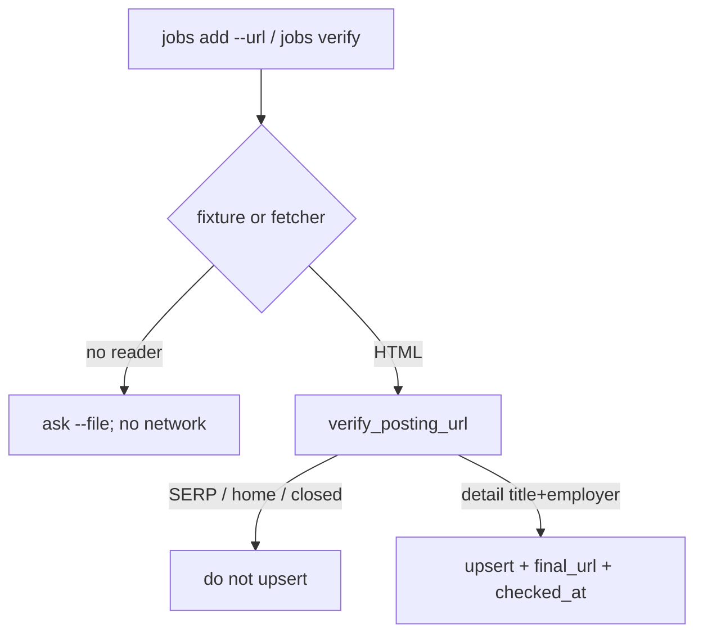
```mermaid
flowchart TD
  U[jobs add --url / jobs verify] --> F{fixture or fetcher}
  F -->|no reader| Ask[ask --file; no network]
  F -->|HTML| V[verify_posting_url]
  V -->|SERP / home / closed| Reject[do not upsert]
  V -->|detail title+employer| Save[upsert + final_url + checked_at]
```

## LinkedIn details pull — sección a sección {#linkedin-details-pull}

Patrones: **ProfileAdapter** (pull), **Result** por sección. Issue: #386 (#194 snapshot vacío).

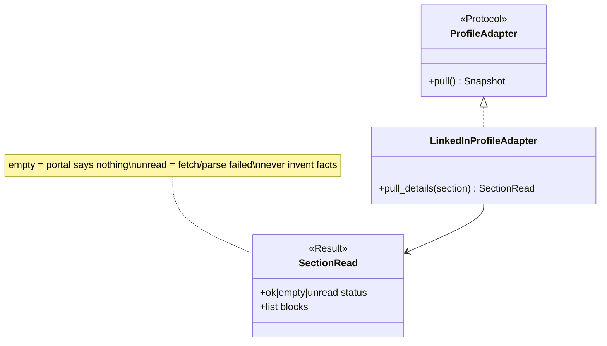
```mermaid
classDiagram
  direction TB
  class ProfileAdapter {
    <<Protocol>>
    +pull() Snapshot
  }
  class SectionRead {
    <<Result>>
    +ok|empty|unread status
    +list blocks
  }
  class LinkedInProfileAdapter {
    +pull_details(section) SectionRead
  }
  ProfileAdapter <|.. LinkedInProfileAdapter
  LinkedInProfileAdapter --> SectionRead
  note for SectionRead "empty = portal says nothing\nunread = fetch/parse failed\nnever invent facts"
```

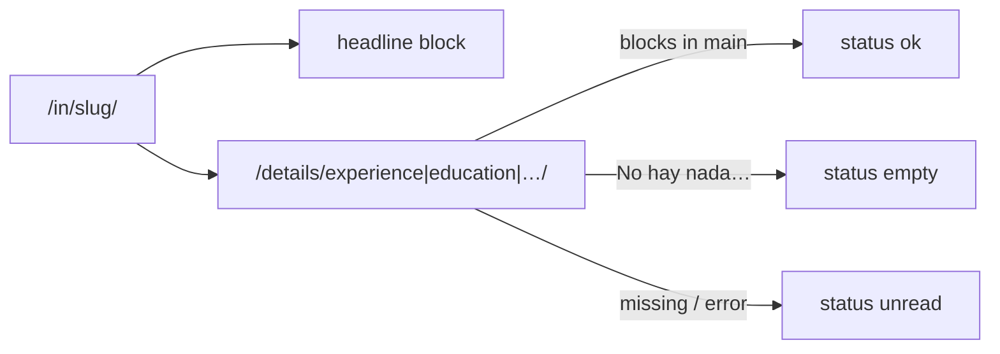
```mermaid
flowchart LR
  P["/in/slug/"] --> H[headline block]
  P --> D["/details/experience|education|…/"]
  D -->|blocks in main| Ok[status ok]
  D -->|No hay nada…| Empty[status empty]
  D -->|missing / error| Unread[status unread]
```

## JD LLM extract — anclado al texto {#jd-llm-extract}

Patrones: **Optional LLM** (`nlp/gateway`) + **Validator** (grounding). Issue: #384 (#85 chrome).

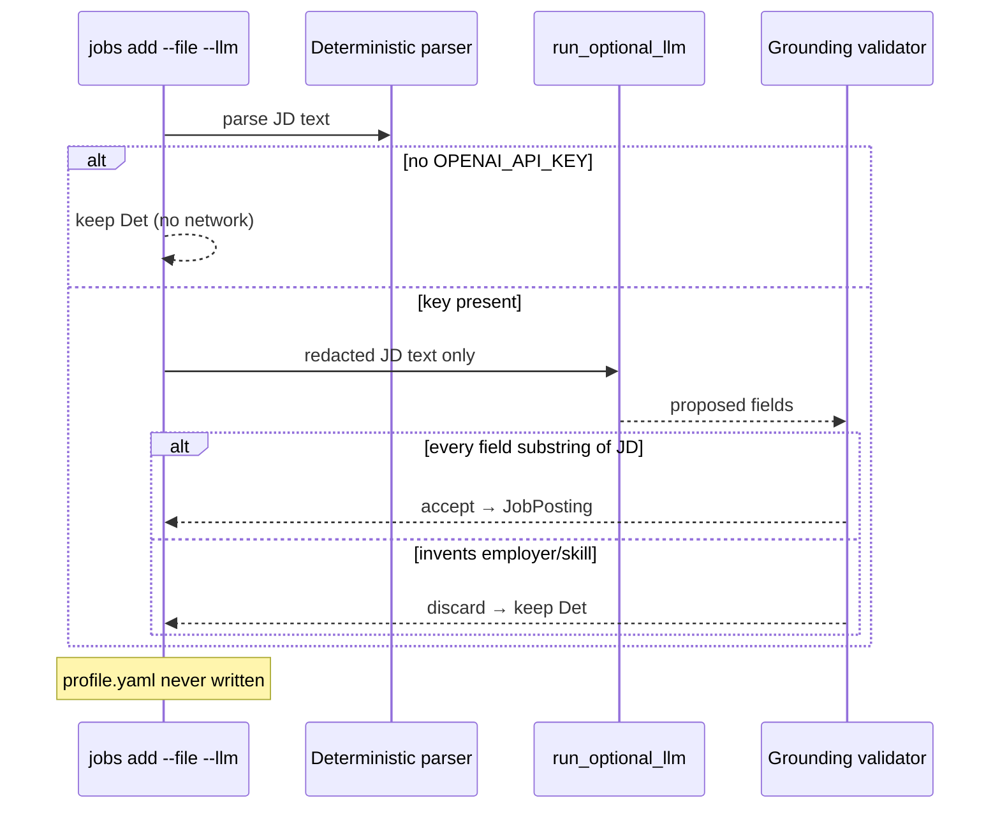
```mermaid
sequenceDiagram
  participant CLI as jobs add --file --llm
  participant Det as Deterministic parser
  participant GW as run_optional_llm
  participant Val as Grounding validator
  CLI->>Det: parse JD text
  alt no OPENAI_API_KEY
    CLI-->>CLI: keep Det (no network)
  else key present
    CLI->>GW: redacted JD text only
    GW-->>Val: proposed fields
    alt every field substring of JD
      Val-->>CLI: accept → JobPosting
    else invents employer/skill
      Val-->>CLI: discard → keep Det
    end
  end
  Note over CLI: profile.yaml never written
```

## Update mutex — un solo `jobbot update` a la vez {#update-mutex}

Patrones: **Mutex** / exclusive lock file (pid + stale reclaim). Issue: #398 (#189 dejó el lock fuera).

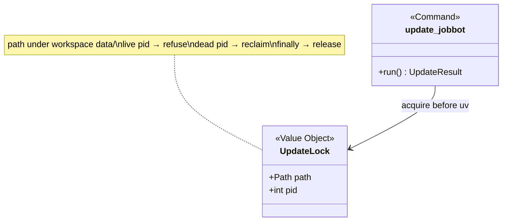
```mermaid
classDiagram
  direction TB
  class UpdateLock {
    <<Value Object>>
    +Path path
    +int pid
  }
  class update_jobbot {
    <<Command>>
    +run() UpdateResult
  }
  update_jobbot --> UpdateLock : acquire before uv
  note for UpdateLock "path under workspace data/\nlive pid → refuse\ndead pid → reclaim\nfinally → release"
```

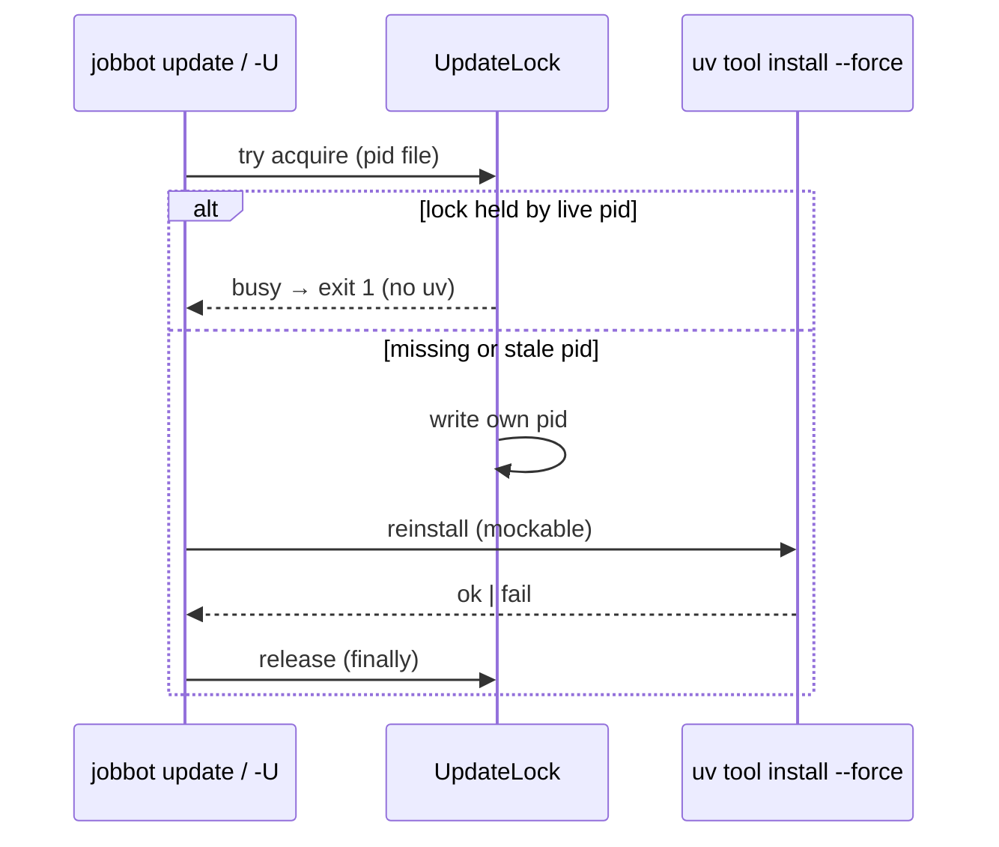
```mermaid
sequenceDiagram
  participant CLI as jobbot update / -U
  participant Lock as UpdateLock
  participant UV as uv tool install --force
  CLI->>Lock: try acquire (pid file)
  alt lock held by live pid
    Lock-->>CLI: busy → exit 1 (no uv)
  else missing or stale pid
    Lock->>Lock: write own pid
    CLI->>UV: reinstall (mockable)
    UV-->>CLI: ok | fail
    CLI->>Lock: release (finally)
  end
```

Reglas: el lock vive junto al data del workspace (no en un checkout compartido sin workspace); nunca inventar el lock en el repo; tests mockean el instalador — sin `uv` real.

## Indeed Apply — avance clasificado, nunca Submit {#indeed-apply-advance}

Patrones: **Strategy** (`IndeedApplyAdapter`), **Specification** (`button_role` / `pressable_advance` — #188), stop-before-submit. Issue: #412 (#188 clasifica; #402 adjunto PDF).

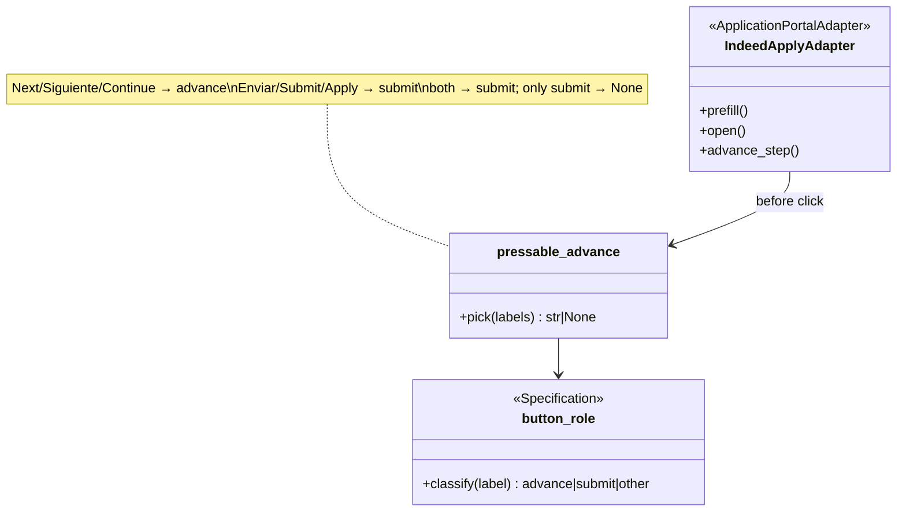
```mermaid
classDiagram
  direction TB
  class IndeedApplyAdapter {
    <<ApplicationPortalAdapter>>
    +prefill()
    +open()
    +advance_step()
  }
  class button_role {
    <<Specification>>
    +classify(label) advance|submit|other
  }
  class pressable_advance {
    +pick(labels) str|None
  }
  IndeedApplyAdapter --> pressable_advance : before click
  pressable_advance --> button_role
  note for pressable_advance "Next/Siguiente/Continue → advance\nEnviar/Submit/Apply → submit\nboth → submit; only submit → None"
```

```mermaid
sequenceDiagram
  participant CLI as application apply --apply
  participant Ad as IndeedApplyAdapter
  participant Page as Indeed Apply page
  participant Human
  CLI->>Ad: open applystart / ATS
  Ad->>Page: list button labels
  Ad->>Ad: pressable_advance(labels)
  alt label advance
    Ad->>Page: click advance only
  else None (submit-only or empty)
    Ad-->>CLI: name submit button; no click
  end
  Note over Ad,Human: CAPTCHA / 2FA / terms / final Submit = HITL
```

Reglas: ningún botón con rol `submit` se pulsa; CAPTCHA/2FA/términos y el envío final quedan fuera (#412). Depende del clasificador #188; el adjunto de CV es #402.

## Postulate — clasificar, abrir opcional, promote aparte {#postulate-route}

Patrones: **Result** (`PostulateRoute`), **Command** plan-then-apply (`--apply`), **promote** explícito al registry. Issues: #410 (#41 clasifica con `--fixture`).

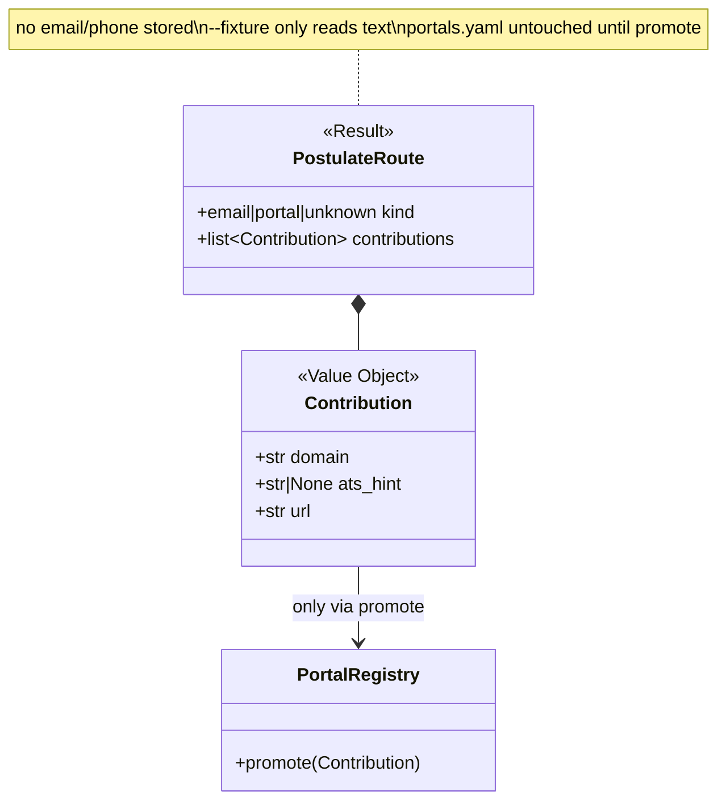
```mermaid
classDiagram
  direction TB
  class PostulateRoute {
    <<Result>>
    +email|portal|unknown kind
    +list~Contribution~ contributions
  }
  class Contribution {
    <<Value Object>>
    +str domain
    +str|None ats_hint
    +str url
  }
  class PortalRegistry {
    +promote(Contribution)
  }
  PostulateRoute *-- Contribution
  Contribution --> PortalRegistry : only via promote
  note for PostulateRoute "no email/phone stored\n--fixture only reads text\nportals.yaml untouched until promote"
```

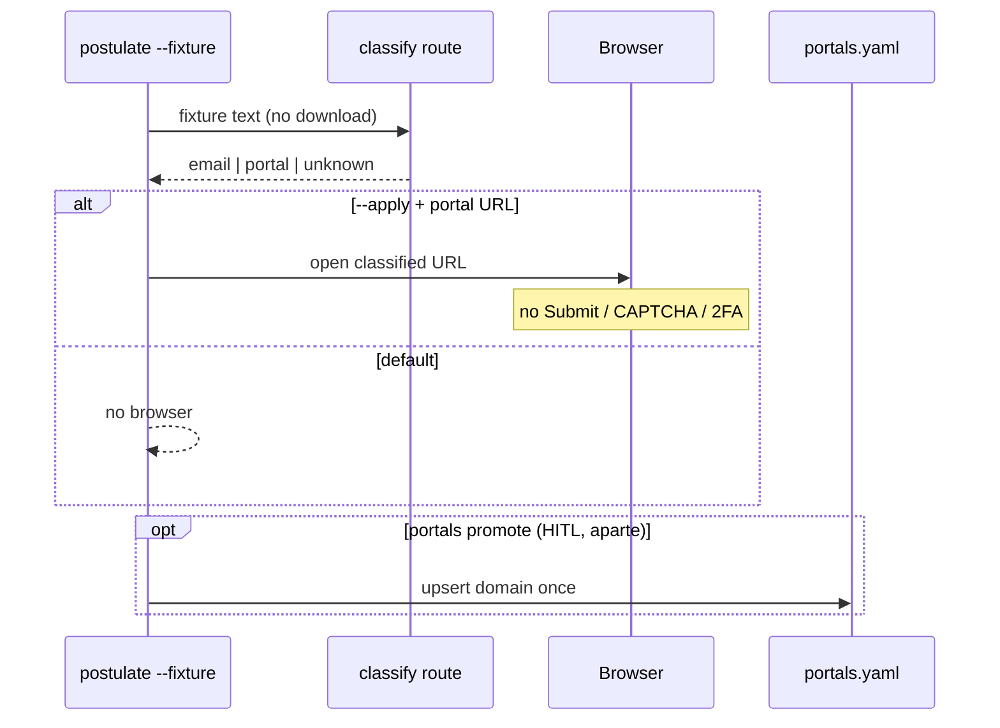
```mermaid
sequenceDiagram
  participant CLI as postulate --fixture
  participant Class as classify route
  participant Browser
  participant Reg as portals.yaml
  CLI->>Class: fixture text (no download)
  Class-->>CLI: email | portal | unknown
  alt --apply + portal URL
    CLI->>Browser: open classified URL
    Note over Browser: no Submit / CAPTCHA / 2FA
  else default
    CLI-->>CLI: no browser
  end
  opt portals promote (HITL, aparte)
    CLI->>Reg: upsert domain once
  end
```

Reglas: sin `--apply` no se abre nada; `--apply` no marca `applied`; promote es otro comando y es idempotente por dominio. Fuera de alcance: LinkedIn en vivo, CAPTCHA, 2FA, envío.

## CV derived translation — build lee lo ya validado {#cv-derived-translation}

Patrones: **Projection** (`DerivedCvTexts`), **Validator** (`cv translate` #34), build como presentación. Issue: #408 (fuera: auto-traducir, escribir el YAML, overlay `#400`).

```mermaid
classDiagram
  direction TB
  class Candidate {
    <<Fact aggregate>>
    +achievements by id
  }
  class DerivedCvTexts {
    <<Projection>>
    +str lang
    +dict id_to_phrase
  }
  class translate_gate {
    <<Validator>>
    +accept(id, base, phrase) bool
  }
  class cv_build {
    <<Command>>
    +build(--lang) artifact
  }
  Candidate --> DerivedCvTexts : texts only
  translate_gate ..> Candidate : figures + company + skills
  translate_gate ..> DerivedCvTexts : accept | reject
  cv_build --> DerivedCvTexts : use if accepted
  cv_build --> Candidate : fallback base text
  note for cv_build "never writes profile.yaml\nmissing file → base + message"
```

```mermaid
flowchart TD
  B[cv build --lang en] --> F{output/cv/en.yaml?}
  F -->|missing| Base[use profile text by id]
  F -->|has id| G{cv translate would accept?}
  G -->|yes| Use[emit derived phrase]
  G -->|no| Base
  F --> Msg[print per id: used | no translation; the source text stays]
  Use --> Art[TeX/PDF]
  Base --> Art
  Art --> P[(profile.yaml unchanged)]
```

Reglas: misma invariante que #34 (cifra, empresa del texto, no skills nuevas); distinto de `ProfileOverlay` / `profile.en.yaml` (#400).

## Public queue — share → PR → `-U` {#public-queue-sync}

Patrones: **Guard** (`share_refusal` #106), **durable Queue**, **idempotent PR batch**, sync via `jobbot -U`. Issue: #418 (#189 `-U` reinstall; #52 promote sigue HITL).

```mermaid
classDiagram
  direction TB
  class share_refusal {
    <<Guard>>
    +reason|None check(line)
  }
  class ShareQueue {
    +Path local
    +enqueue(Contribution)
    +pending() list
  }
  class ShareBatch {
    +str batch_id
    +list lines
  }
  class CommonsSnapshot {
    <<Port>>
    +open_pr(ShareBatch)
    +pull_main()
  }
  share_refusal --> ShareQueue : only if empty reason
  ShareQueue --> ShareBatch : group
  ShareBatch --> CommonsSnapshot : one PR per batch_id
  CommonsSnapshot --> CompanyRegistry : foreign → candidate
```

```mermaid
sequenceDiagram
  participant Obs as observation / export line
  participant Guard as share_refusal
  participant Q as ShareQueue
  participant GH as GitHub PR
  participant U as jobbot -U
  participant Reg as local companies.yaml
  Obs->>Guard: line text
  alt contact or home path
    Guard-->>Obs: refuse (no enqueue)
  else clean
    Guard->>Q: enqueue
    alt offline
      Q-->>Q: keep on disk; search continues
    else online
      Q->>GH: open PR for batch (no duplicate)
    end
  end
  U->>Reg: pull main snapshot
  Note over Reg: new rows = candidate; promote stays HITL
```

Reglas: nada corre si la línea fue rechazada; no inventar cuenta GitHub; no compartir `profile.yaml`. `jobbot -U` actualiza programa **y** copia local del mapa desde `main` según el PR de implementación.

## Capability gaps — inventario → contrato {#capability-gap-map}

Patrones: **inventory** de puertos faltantes (ai-job-search / homónimos). Issue: #424 (mapa; no implementa). Fuera: autopilot, OAuth bandeja, inventar, followup #422.

```mermaid
flowchart LR
  Gap[stolen use-case row] --> C{falsifiable contract?}
  C -->|no| Open[child issue + SDD patch]
  C -->|yes| Port[ports / Command / Spec]
  Port --> Test[unit fixture offline]
  Test --> Done[row closed]
  Gap -.->|forbidden| No[autopilot / invent / inbox OAuth]
```

```mermaid
classDiagram
  direction TB
  class GapRow {
    +str name
    +str pattern
    +str test_contract
    +str|None child_issue
  }
  class CapabilityGapMap {
    +list~GapRow~ rows
  }
  CapabilityGapMap *-- GapRow
  note for GapRow "structured interview gaps\nexpand+provenance\nportal health\nreviewer ≠ advise\ntemplate registry\nstudy question from market"
```

Reglas: #424 se cumple documentando contratos, no shippeando las seis features en un solo PR.

## Indeed Apply — adjuntar PDF del aviso, nunca Enviar {#indeed-apply-attach}

Patrones: **Strategy** (`attach_cv`), **Command** (solo `set_input_files`). Issue: #402. Complementa [#412](uml.md#indeed-apply-advance) (avance). Fuera: Siguiente, CAPTCHA, 2FA, términos, Submit.

```mermaid
classDiagram
  direction TB
  class IndeedApplyAdapter {
    <<ApplicationPortalAdapter>>
    +page_asks_for_cv() bool
    +tailored_cv_path() Path|None
    +attach_cv(page)
  }
  class TailoredCv {
    <<Artifact>>
    +Path job_package_pdf
  }
  IndeedApplyAdapter --> TailoredCv : set_input_files if asks
  note for IndeedApplyAdapter "null path → missing_tailored_cv\ncover-letter input ignored\nno Submit click"
```

```mermaid
sequenceDiagram
  participant Ad as IndeedApplyAdapter
  participant Page
  Ad->>Ad: page_asks_for_cv?
  alt false
    Ad-->>Ad: no set_input_files
  else true + tailored path
    Ad->>Page: set_input_files(cv.pdf)
  else true + missing path
    Ad-->>Ad: print missing_tailored_cv
  end
  Note over Ad,Page: never click Enviar / Postular / Submit
```

Reglas: solo el PDF del paquete del aviso; input de carta no recibe CV; envío final = HITL (#402).

## Search filters — preferencia antes de upsert {#search-filters}

Patrones: **Preference** (`SearchFilters`), **Specification** (`apply_search_filters`), **Command** dry-run / confirm / `--store`. Issue: #374. Relacionado: [`search-outcome`](uml.md#search-outcome), [`fact-preference`](uml.md#fact-preference).

```mermaid
classDiagram
  direction TB
  class SearchFilters {
    <<Preference VO>>
    +list~str~ exclude_title_terms
    +list locations
    +Relocation|None relocation
    +Money|None min_salary
  }
  class FilterDecision {
    <<Result>>
    +keep|drop verdict
    +str reason
  }
  class apply_search_filters {
    <<Specification>>
    +decide(JobPosting, SearchFilters) FilterDecision
  }
  SearchFilters --> apply_search_filters
  apply_search_filters --> FilterDecision
  note for SearchFilters "not a Fact; profile validate\nunknown currency → reject"
```

```mermaid
flowchart TD
  S[search / torre / getonboard] --> D{--dry-run?}
  D -->|yes| T[table: keep/drop + reason]
  T --> Z[no DB / companies write]
  D -->|no + TTY| C{confirm?}
  C -->|no| X[exit 130]
  C -->|yes| F[apply_search_filters]
  D -->|--store| F
  F --> U[upsert keep rows only]
```

Reglas: sin filtros = comportamiento actual; `--dry-run --store` = exit 2; motivos estables («título excluido», «renta no publicada», …). Fuera: label Torre Remote (#181), check-open (#207).

## CV tune-for — mejora acotada desde un aviso {#cv-tune-for}

Patrones: **Command** (`cv tune-for`), budget, HITL `--apply`. Issue: #54. Reusa gates de `cv advise` (never invent / no-drop).

```mermaid
sequenceDiagram
  participant CLI as cv tune-for
  participant Get as hard-link ingest
  participant Adv as cv advise --job
  participant Hum as Human
  participant SoT as profile.yaml
  alt URL
    CLI->>Get: store JobPosting
  else Jxxxx
    CLI->>CLI: load stored
  end
  CLI->>Adv: scope=that job; budget 3..5
  Adv-->>CLI: suggestions (invention dropped)
  alt --apply
    loop each suggestion
      CLI->>Hum: y / N / skip-all
      Hum-->>CLI: yes
      CLI->>SoT: backup then write
    end
  else dry-run
    CLI-->>CLI: print only
  end
```

```mermaid
classDiagram
  direction TB
  class TuneForCommand {
    <<Command>>
    +url_or_job_id
    +budget int
    +apply bool
  }
  class AdviceBudget {
    <<Value Object>>
    +int max_suggestions
  }
  TuneForCommand --> AdviceBudget
  TuneForCommand --> JobPosting : scopes
  note for TuneForCommand "~5% product metaphor\nnot a percentage calc\ncv build --job stays derived"
```

Reglas: no reescribe el baseline entero; tailored CV sigue en `cv build --job`; LLM opcional queda en advise.

## Trabajando.cl — perfil por sección + límites {#trabajando-profile-push}

Patrones: **WritableProfileAdapter**, **Validator** de límites (SST + legacy), **ACL** CEFR→nivel, plan-then-apply. Issues: #285 (#150 fila 7).

```mermaid
classDiagram
  direction TB
  class TrabajandoProfileAdapter {
    <<WritableProfileAdapter>>
    +diff()
    +sync_plan(section)
    +apply(section)
  }
  class FieldLimit {
    <<Value Object>>
    +str field
    +int max_len
  }
  class LegacyViolation {
    <<Result>>
    +str entry_id
    +str field
    +int length
  }
  class SectionPlan {
    <<Command plan>>
    +full section payload
    +list~LegacyViolation~ blockers
    +list needs_human
  }
  TrabajandoProfileAdapter --> FieldLimit
  TrabajandoProfileAdapter --> SectionPlan
  SectionPlan *-- LegacyViolation
  note for SectionPlan "portal re-POSTs whole section\nlegacy over-limit → refuse push\nno RUN / DOB / invented jornada"
```

```mermaid
flowchart TD
  Diff[portals profile diff trabajando] --> L{legacy over limit?}
  L -->|yes| Warn[mark blocker on entry]
  Push[push --section --apply] --> V{SST or legacy invalid?}
  V -->|yes| E2[exit 2; no HTTP]
  V -->|no| HITL[confirm section]
  HITL -->|no| E130[exit 130]
  HITL -->|yes| POST[save section]
  POST -->|400| E1[exit 1; state unchanged]
  POST -->|ok| Reread[re-read; mark updated]
```

Reglas: `--fix-legacy` propone recorte con confirm por entrada; `needs_human` para renta/jornada sin hecho; fixtures sin PII.

## Cómo citar desde un issue

```markdown
## SDD / patrones
- SDD: docs/software-design.md §3 / §8
- Patrón(es): Value Object, Aggregate
- UML: docs/uml.md#fact-preference
- El PR actualiza el diagrama si introduce o renombra un tipo
```
